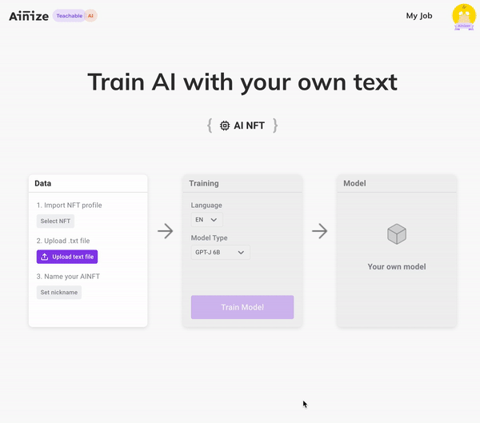
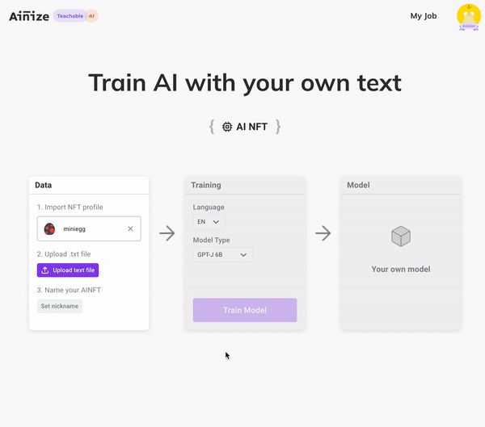
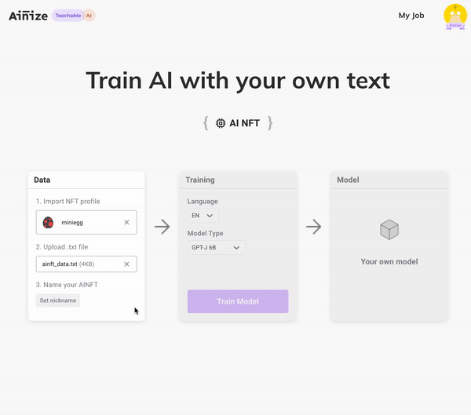
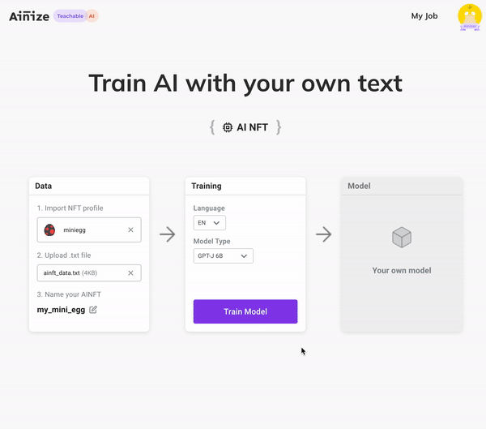
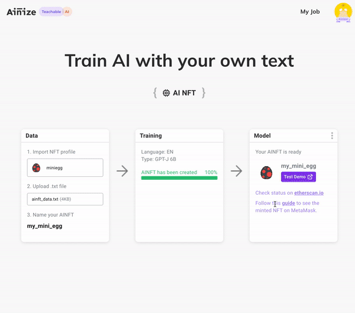
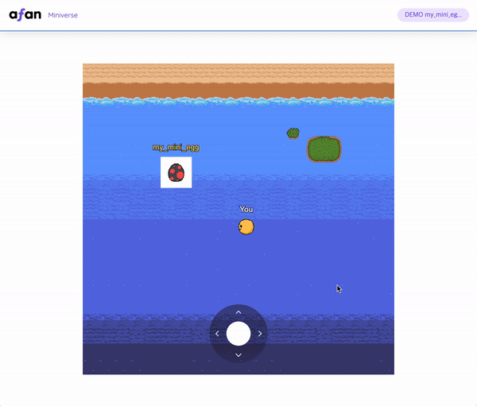

# AINFTs
AINFT prompt collections made by Common Computer.

## What is AINFT?
AINFT is an immutable identifier that represents the connectivity of AI components. It is an accountable, reproducible, and valuable unit of AI managed by communities on the Internet for AI. If you want to know more about it, please visit out [medium blog](https://medium.com/ai-network/ainft-make-ai-accountable-reproducible-and-valuable-1e216ed123b0).

## How to make AINFT using Teachable-AINFT
Teachable-AINFT is a service that create your own AINFT and easily mint the created AINFT to opensea.

In order to use Teachable-AINFT, you have to prepare the following:

* [Metamask](https://metamask.io/)
* NFT purchased from opensea.
* Your AINFT prompt text

### 1. Make Prompt Text
You should define the prompt text of the chatbot using the prompt engineering. The prompt text consists of "task description", and "optional information" and "examples". For example, you can create your own AINFT using the prompt text as below.

```
The following is a conversation with an AI assistant. The assistant is helpful, creative, clever, and very friendly.

Human: Hello, who are you?
AI: I am an AI created by Common Computer. How can I help you today?
Human: ...
AI: ...
...
```

Task Description
```
The following is a conversation with an AI assistant.
```

Optional Information
```
The assistant is helpful, creative, clever, and very friendly.
```

Examples
```
Human: Hello, who are you?
AI: I am an AI created by Common Computer. How can I help you today?
Human: ...
AI: ...
```

If you want to know more about prompt engineering, please visit out [medium blog](https://medium.com/ai-network/everyones-ai-open-source-version-of-gpt-3-gpt-j-e7d0c71b4532). 

If you want to see an example made by someone else, visit the current repository or [teachable-ainize/ainft repository](https://github.com/teachable-ainize/ainft).

### 2. Upload your data
Go to [teachable-inft](https://ainize.ai/teachable-nft) and select your NFT.


Upload your promt text.


Set your AINFT name


### 3. Train you AINFT
Click "Train Model" and please wait just a moment. This work takes a few minutes.


### 4. Go to Miniverse
Go to the miniverse and meet the AINFT you made.


### 5. Chat with your AINFT
Chat with your AINFT on miniverse
